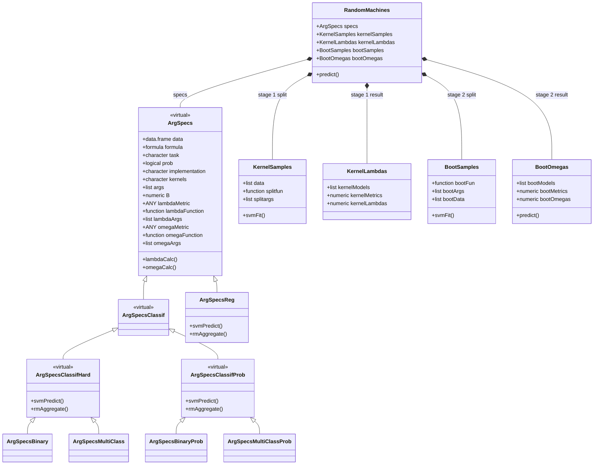
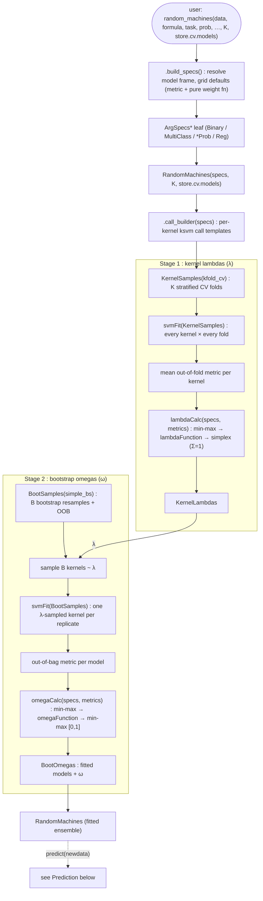
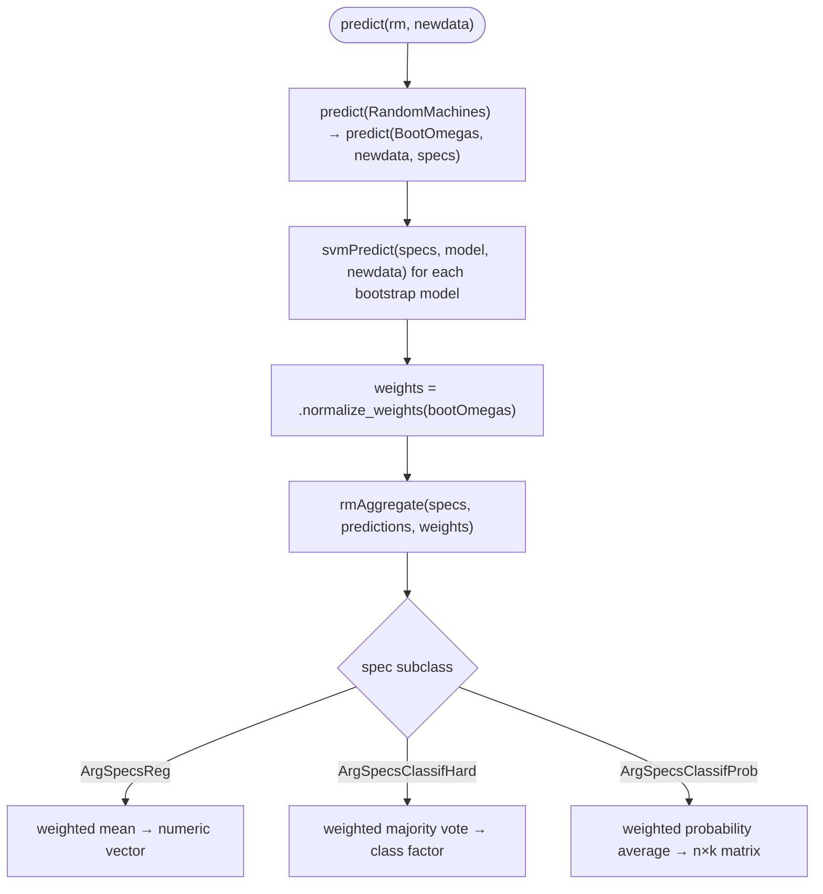

# Architecture: the `randomMachines` pipeline

`randomMachines` fits a weighted ensemble of kernel SVMs in **two stages**:

1. **Kernel lambdas.** Cross-validate every candidate kernel and turn its mean
   out-of-fold performance into a *selection probability* (λ).
2. **Bootstrap omegas.** Draw `B` bootstrap replicates, fit a λ-sampled kernel on
   each, and weight the models by their out-of-bag performance (ω).

Prediction scores new data with every bootstrap model and aggregates the results,
weighted by the normalised ω. The public entry point is a single verb,
`random_machines()`, which builds a specification and fits the ensemble; it
returns a self-contained `RandomMachines` object you score with `predict()`.

The design is S4 throughout: a virtual `ArgSpecs` spec whose task subclass drives
prediction and aggregation dispatch, and small value classes for each pipeline
stage.

---

## Class model

**How to read it**

- `<|--` is **inheritance**, `*--` is **composition** (a `RandomMachines` *owns* one
  of each stage object).
- **`prob` is a type, not a runtime flag.** Classification splits into two virtual
  branches, `ArgSpecsClassifHard` (predictions are class factors) and
  `ArgSpecsClassifProb` (predictions are class-probability matrices), each with
  concrete binary and multiclass leaves. So `svmPredict()` and `rmAggregate()`
  dispatch to the right shape with **no `if (prob)` branch**. `ArgSpecsReg` is the
  regression leaf. Binary and multiclass stay distinct concrete leaves (task
  labelling and a home for future task-specific overrides), though both currently
  share the Hard/Prob methods.
- `lambdaCalc()` and `omegaCalc()` are attached to the **`ArgSpecs` base** (inherited
  by all): they run the normalization pipeline around the spec's pure weight
  functions (see *Fit pipeline*).
- `data` on `ArgSpecs` is the **resolved model frame**, stored once, so a fitted
  object is self-contained and survives `saveRDS`/reload. `specs` is held **only**
  on `RandomMachines`; `BootOmegas` receives it at predict time.

---

## Fit pipeline

`random_machines()` → `.build_specs()` (spec) → `RandomMachines()` (orchestrator)
→ the two stages → a fitted object.

Both stages fit through the **same** `svmFit` generic and the shared per-fit
helper `.fit_one()` (fit, predict held-out rows, score); they differ only in the
resample object they dispatch on.

**The normalization pipeline.** The weight and probability functions
(`logit_weights`, `inv_logit_weights`, `softmax_weights`, `inv_sq_gap_weights`,
`inv_sq_weights`) are **pure transforms** with only `eps` domain guards; they do no
normalization. All scaling lives in `lambdaCalc()` and `omegaCalc()`:

- **both stages** min-max scale the raw metrics before the transform;
- **lambda** projects the transform's output onto the probability simplex (Σ=1, the
  hard sampling-weight rule);
- **omega** min-max scales the output to `[0, 1]` (a comparable share; the final Σ=1
  voting weights form at predict time via `.normalize_weights`).

A **metric** is any `function(truth, estimate)` returning a single finite numeric
(estimate is a numeric vector, class factor, or probability matrix by task). The
defaults, accuracy, RMSE and Brier, are **built into the package** with no external
metrics dependency; a user may pass any function honouring that contract, checked
at construction. Metrics are min-max scaled *without flipping*, so a **minimize**
metric (RMSE, Brier) puts the best model at `x = 0` and a **maximize** metric
(accuracy) at `x = 1`. Each metric is therefore paired with an orientation-matching
function (minimize with decreasing, maximize with increasing); validity rejects a
mismatched pair. `beta` for `softmax_weights` is carried in `lambdaArgs` and
`omegaArgs` and may differ between the two stages. Setting `store.cv.models = TRUE`
keeps the stage-1 fold models in `kernelLambdas@kernelModels` (off by default, as
they are diagnostic only).

---

## Prediction

`svmPredict()` returns the shape each case needs (numeric, class factor, or
probability matrix); `rmAggregate()` combines them, dispatching on the same
`ArgSpecs` subclass. Classification probability and vote columns are aligned **by
class name**, so models trained on different resamples combine correctly.

---

## Slot reference

| Class | Key slots | Role |
|---|---|---|
| `ArgSpecs` *(virtual)* | `data` (model frame), `formula`, `task`, `prob`, `implementation`, `kernels`, `args`, `B`, `lambdaMetric`, `lambdaFunction`, `lambdaArgs`, `omegaMetric`, `omegaFunction`, `omegaArgs` | The fitting specification; task subclass drives dispatch |
| `ArgSpecsClassif` *(virtual)* | (none) | Shared parent of all classification specs (response must be a factor) |
| `ArgSpecsClassifHard` *(virtual)* | (none) | Hard classification: class-factor predictions, hard-class metric |
| `ArgSpecsClassifProb` *(virtual)* | (none) | Probabilistic classification: probability-matrix predictions, Brier-score metric |
| `ArgSpecsBinary` / `ArgSpecsMultiClass` | (none) | Concrete hard-classification leaves |
| `ArgSpecsBinaryProb` / `ArgSpecsMultiClassProb` | (none) | Concrete probabilistic-classification leaves |
| `ArgSpecsReg` | (none) | Concrete regression leaf |
| `KernelSamples` | `data` (CV split), `splitfun`, `splitargs` | Stage-1 cross-validation folds |
| `KernelLambdas` | `kernelMetrics`, `kernelLambdas`, `kernelModels` | Stage-1 kernel probabilities (λ) |
| `BootSamples` | `bootData` (train/OOB indices), `bootFun`, `bootArgs` | Stage-2 bootstrap resamples |
| `BootOmegas` | `bootModels`, `bootMetrics`, `bootOmegas` | Stage-2 fitted models and weights (ω) |
| `RandomMachines` | `specs` plus the four stage objects | The fitted ensemble; entry point for `predict()` |

---

## Testing

The suite pairs focused unit tests on each component with end-to-end tests on the
whole pipeline.

**Unit tests** cover the pieces in isolation: the pure weight transforms and the
normalization pipeline (`test-weights.R`), the built-in metrics and the metric
contract (`test-metrics.R`), the resampling functions (`test-resample.R`), the two
`svmFit` strategies (`test-fit.R`), stage-1 assembly (`test-KernelLambdas.R`), and
the prediction and aggregation methods (`test-predict-methods.R`,
`test-svm-methods.R`).

**End-to-end tests** (`test-e2e.R`) fit `random_machines()` and score `predict()`
on several datasets per task. Every case asserts two things: the output contract (a
numeric vector, a class factor, or a class-probability matrix whose rows sum to 1
with class-named columns) and real predictive skill, beating a trivial baseline
(majority class or mean predictor). A model that runs but does not learn therefore
fails.

Beyond the happy path, the end-to-end tests stress the pipeline on:

- **Imbalanced classes.** Well-separated blobs with skewed group sizes (about 86/14
  binary, 100/40/15 multiclass); the assertion is that the rare class is recovered
  (minority recall), not merely that the majority baseline is beaten.
- **Custom metrics.** User-supplied `function(truth, estimate)` metrics passed as
  `lambdaMetric`/`omegaMetric` for each task (balanced accuracy, MAE, log-loss), a
  bare metric with no `direction` attribute (whose orientation check is skipped),
  and an invalid metric rejected at construction.
- **Ensemble size.** A range of `B` from 1 upward, checking the fitted object holds
  exactly `B` bootstrap models and that probabilistic output stays a distribution
  at every `B`.
- **Very small data.** Down to five observations per class, and the
  minimum-observation boundary (fewer than five rows is rejected).

Seeds are fixed and thresholds carry margin over calibrated performance, so the
tests are deterministic rather than flaky.

---

*Generated as living documentation of the class pipeline; keep in sync with `R/`.*
