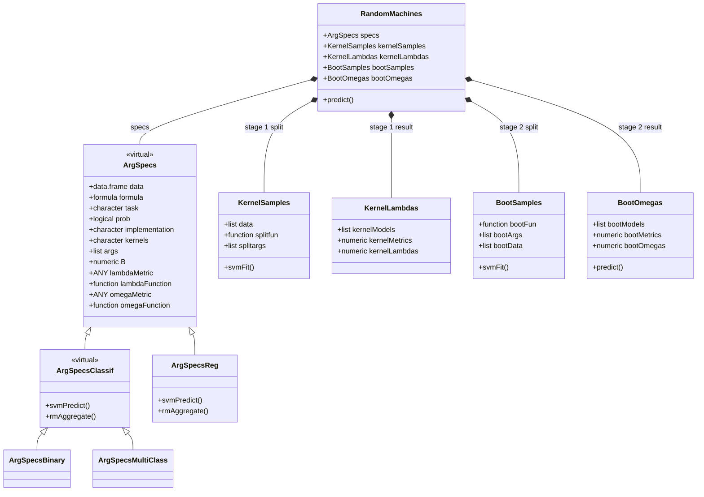
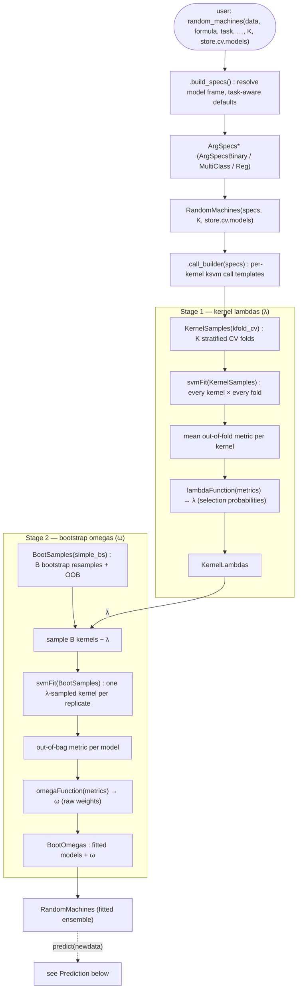
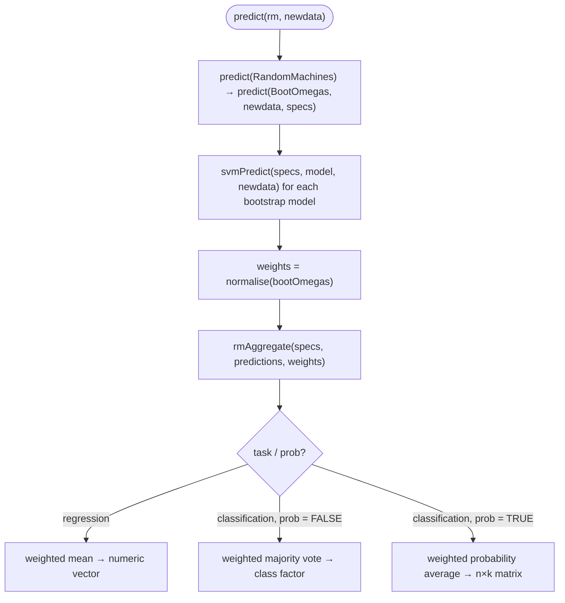

# Architecture — the `randomMachines` pipeline

`randomMachines` fits a weighted ensemble of kernel SVMs in **two stages**:

1. **Kernel lambdas** — cross-validate every candidate kernel and turn its mean
   out-of-fold performance into a *selection probability* (λ).
2. **Bootstrap omegas** — draw `B` bootstrap replicates, fit a λ-sampled kernel on
   each, and weight the models by their out-of-bag performance (ω).

Prediction scores new data with every bootstrap model and aggregates the results,
weighted by the (normalised) ω. The public entry point is a single verb,
`random_machines()`, which builds a specification and fits the ensemble; it
returns a self-contained `RandomMachines` object you score with `predict()`.

The design is S4 throughout: a virtual `ArgSpecs` spec whose task subclass drives
prediction/aggregation dispatch, and small value classes for each pipeline stage.

---

## Class model

**How to read it**

- `<|--` is **inheritance** (`ArgSpecsBinary` *is an* `ArgSpecsClassif` *is an*
  `ArgSpecs`). `*--` is **composition** (a `RandomMachines` *owns* one of each
  stage object).
- Methods shown inside a class are the **S4 methods dispatched on it**.
  `svmPredict()` / `rmAggregate()` sit on `ArgSpecsClassif` (shared by binary +
  multiclass via inheritance) and on `ArgSpecsReg`. `svmFit()` dispatches on the
  *resample* object — `KernelSamples` runs stage 1, `BootSamples` runs stage 2.
- `data` on `ArgSpecs` is the **resolved model frame**, stored once, so a fitted
  object is self-contained and survives `saveRDS`/reload. `specs` is held **only**
  on `RandomMachines`; `BootOmegas` receives it at predict time.

---

## Fit pipeline

`random_machines()` → `.build_specs()` (spec) → `RandomMachines()` (orchestrator)
→ the two stages → a fitted object.

Both stages fit through the **same** `svmFit` generic and the shared per-fit
helper `.fit_one()` (fit → predict held-out rows → score); they differ only in the
resample object they dispatch on. Setting `store.cv.models = TRUE` keeps the
stage-1 fold models in `kernelLambdas@kernelModels` (off by default — they are
diagnostic only).

---

## Prediction

`svmPredict()` returns the shape each case needs (numeric / class factor /
probability matrix); `rmAggregate()` combines them, dispatching on the same
`ArgSpecs` subclass. Classification probability/vote columns are aligned **by
class name**, so models trained on different resamples combine correctly.

---

## Slot reference

| Class | Key slots | Role |
|---|---|---|
| `ArgSpecs` *(virtual)* | `data` (model frame), `formula`, `task`, `prob`, `implementation`, `kernels`, `args`, `B`, `lambda*/omega*` | The fitting specification; task subclass drives dispatch |
| `ArgSpecsClassif` *(virtual)* | — | Shared parent of binary + multiclass (one method set for both) |
| `ArgSpecsBinary` / `ArgSpecsMultiClass` / `ArgSpecsReg` | — | Concrete task specs |
| `KernelSamples` | `data` (CV split), `splitfun`, `splitargs` | Stage-1 cross-validation folds |
| `KernelLambdas` | `kernelMetrics`, `kernelLambdas`, `kernelModels` | Stage-1 kernel probabilities (λ) |
| `BootSamples` | `bootData` (train/OOB indices), `bootFun`, `bootArgs` | Stage-2 bootstrap resamples |
| `BootOmegas` | `bootModels`, `bootMetrics`, `bootOmegas` | Stage-2 fitted models + weights (ω) |
| `RandomMachines` | `specs` + the four stage objects | The fitted ensemble; entry point for `predict()` |

*Generated as living documentation of the class pipeline; keep in sync with `R/`.*
