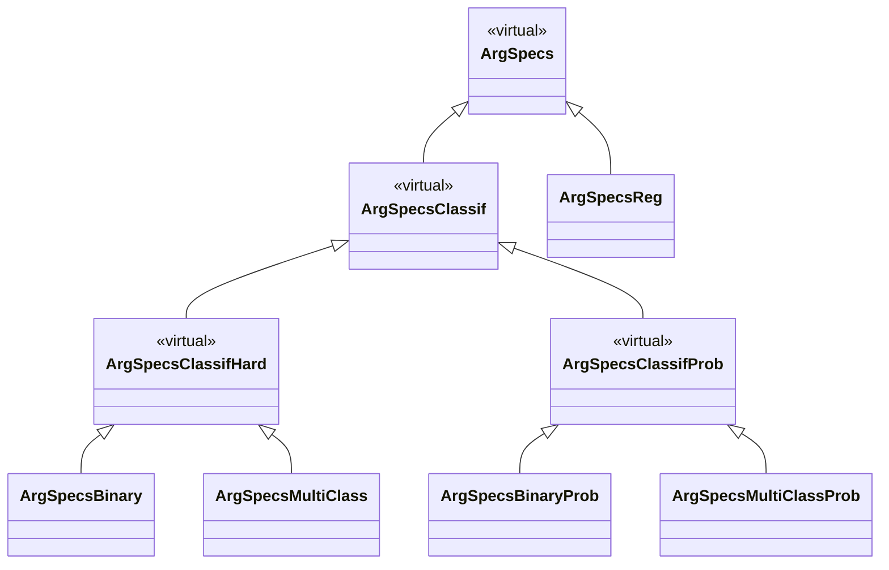

# implementation-plan — Lambda/Omega functions, prob subclasses, normalization

> Synthesises the decisions logged in `plan-response.md` into one cohesive,
> phased plan. **One thing needs your explicit sign-off before I touch classes:**
> the class lattice in §B (you flagged "structuring for dispatch on ArgSpecs
> requires thorough review"). Everything else is settled; §B is drawn as my
> recommendation for you to confirm/adjust.

---

## Amendment — metrics are internalized, no external dependency

> Supersedes the yardstick/`brier_class`/`tidyselect` details throughout this doc.

**No package is a dependency for metrics.** The default metrics are implemented in
the package (`R/metrics.R`): `.metric_accuracy` (maximize), `.metric_rmse`
(minimize), `.metric_brier` (minimize). Each carries a `direction` attribute so the
orientation check (§2/§F) still works. `.default_metric(task, prob)` returns these.
`yardstick` **and** `tidyselect` are dropped from `Imports`.

**A metric is any `function(truth, estimate)` returning a single finite numeric**,
where `estimate` is a numeric vector (regression), a class factor (hard classif) or
an n×k class-probability matrix (prob classif). This makes `.apply_metric()` a
one-liner — `metric(truth, estimate)` — and removes the binary-vs-multiclass column
arity problem entirely: `.metric_brier` scores the **full** probability matrix
uniformly (binary k=2, multiclass k≥3), so the yardstick event-column special case
in the old §A/§F is gone.

**The contract test** every user-supplied metric must pass lives in
`.check_metric_eval()` (validity.R): given task-appropriate toy inputs it must
return a single finite numeric, checked at `new()`. A bad metric fails fast at
construction; a metric with no `direction` attribute simply skips the orientation
check.

---

## Decisions locked (from `plan-response.md`)

| # | Decision |
|---|---|
| 1.1 | Sum-to-1 invariant enforced — but see §A: refined by your Considerations into a min-max/simplex **pipeline**, not per-function |
| 1.2 | Grid confirmed; `exp`/`softmax` for both regression stages; **β may differ** for lambda vs omega |
| 1.3 | Metric defaults: `accuracy` (hard classif), **`brier_class`** (prob classif, minimize), `rmse` (regression); metric ↔ weight-fn orientation must agree |
| 2 | Keep `.metric_direction`; **repurpose** from default-selection to orientation **validation** |
| 3.1 | Functions passed via args; **grid defaults when `NULL`**; β defaults to **0.5** |
| 3.2 | Transform-named, `_weights` suffix (rename table in §C) |
| 4 | **Add probabilistic subclasses; dispatch on them** (§B) |
| 5 | **`fn` + `args` slot pair** (`lambdaArgs`/`omegaArgs`), mirroring `splitfun/splitargs` |
| 6.1 | Full adapt + `document()` + `test()`; nothing excluded |
| 6.2 | **Full bookdown project under `docs/`**, chapters as-is (§I) |
| Cons. 1 | Dispatch structuring needs thorough review → §B is the sign-off gate |
| Cons. 2 | Functions do **no internal normalization**; min-max pre (both stages); post: **min-max** (omega) / **sum-to-1** (lambda) |

**Tension resolved (1.1 vs Considerations):** your Considerations paragraph is the
later, more specific word, so it governs. The sum-to-1 guarantee moves *out of the
functions* and *into the pipeline*, and it applies to **lambda only**; **omega**'s
"interpretable scale" is delivered by **min-max post-scaling** (final vote still
summed to 1 at predict by `.normalize_weights`). Validity therefore stops requiring
a supplied function to sum to 1 (§F).

---

## A. Normalization architecture (the spine of this change)

Score/weight functions become **pure transforms**: input a metric vector, output a
raw transform, with *only* `eps` domain-guards (not normalization). All scaling
becomes the pipeline's job, applied identically inside `lambdaCalc` / `omegaCalc`:

```
lambda (KernelLambdas):   metrics ──minmax──▶ f_λ(·, λargs) ──▶ SIMPLEX (Σ=1)
omega  (BootOmegas):      metrics ──minmax──▶ f_ω(·, ωargs) ──▶ MINMAX  [0,1]
                                                              └─(predict)─▶ .normalize_weights ▶ Σ=1
```

- **min-max pre-scale** (both stages): `(x - min)/(max - min)`, giving `[0,1]`;
  degenerate all-equal input → uniform (guarded).
- **SIMPLEX post** (lambda): shift-to-non-negative then divide by sum — this is the
  exact tail currently living *inside* `log_score`/`brier_score`, lifted out. Result
  Σ=1 (the hard restriction).
- **MINMAX post** (omega): re-scale outputs to `[0,1]`, so ω is a comparable share
  (best model → 1, worst → 0). Predict-time `.normalize_weights` turns these into
  the actual Σ=1 voting weights.

**Orientation under min-max (important):** we min-max the *raw* metric without
flipping, so a **minimize** metric puts the *best* model at scaled `0` and a
**maximize** metric puts it at scaled `1`. Hence:
- maximize-oriented weight fns are **increasing** in `x` (best at `x=1`): `logit_weights`, `inv_sq_gap_weights`.
- minimize-oriented weight fns are **decreasing** in `x` (best at `x=0`): `inv_logit_weights`, `inv_sq_weights`, `softmax_weights` (β>0).

This is what §F's orientation check enforces against the metric's `direction`.

**Endpoint singularities:** min-max forces one point to exactly `0` and one to `1`,
which hits the poles of the inverse transforms (`1/(1-x)²` at `x=1`; `1/x²` at
`x=0`). Functions keep an `eps` clamp as a **domain guard** (allowed — it is not
normalization). Documented as such in each header.

---

## B. Class lattice — **SIGN-OFF GATE**

Today `prob` is a slot branched inside methods. Your decision 4 makes it a **type**,
so dispatch replaces the branches. Recommended lattice:



Rationale: binary/multiclass stay as concrete leaves (you formalised them, and
they're where a task-specific override would attach), while the **new dispatch axis
is Hard vs Prob** at the virtual level — every method that currently branches on
`specs@prob` becomes two methods with no branch. `prob` slot is kept as data (for
`.call_builder`'s `prob.model=`), but is no longer a control-flow switch.

**Method re-targeting (removes all `specs@prob` branches):**

| Generic | Old signature | New method targets |
|---|---|---|
| `svmPredict` | `ArgSpecsReg`, `ArgSpecsClassif` (+prob branch) | `ArgSpecsReg` → numeric; `ArgSpecsClassifHard` → class factor; `ArgSpecsClassifProb` → prob matrix |
| `rmAggregate` | `ArgSpecsReg`, `ArgSpecsClassif` (+prob branch) | `ArgSpecsReg` → wtd mean; `ArgSpecsClassifHard` → wtd vote; `ArgSpecsClassifProb` → wtd prob avg |
| `.metric_input` (helper) | reduce matrix→class always | `Hard` → reduce to class; `Prob` → keep matrix (so `brier_class` gets probs) |
| `lambdaCalc`/`omegaCalc` (§E) | un-dispatchable stub | one method on the `ArgSpecs` virtual base (uniform pipeline; inherited by all) |

`.aggregate_classif` splits into the two `rmAggregate` methods (its `if prob` halves
become the `Prob`/`Hard` method bodies).

**Constructors & default resolution — LOCKED:** add `ArgSpecsBinaryProb()` /
`ArgSpecsMultiClassProb()` constructors (set `task` + `prob=TRUE`). Defaults are
resolved **eagerly** (your call): `.build_specs` looks the default functions up from
an internal grid keyed on `(task, prob)` and stores **concrete functions** in the
slots. So the function slots stay typed `"function"` — **no `functionOrNULL` union**,
and **no `defaultLambdaFn`/`defaultOmegaFn` generics** (moot once resolution is
eager). The `NULL` in decision 3.1 is only the *user-facing argument* default; it is
never stored.

> **§B lattice APPROVED** (Hard/Prob virtual split; keep Binary/MultiClass leaves;
> add `*Prob` leaves). Proceeding on this shape.

---

## C. Score/weight functions — rename + purify (`R/weights.R`)

Exported (decision 3.1 — users pass them by name). Renames (decision 3.2):

| Current | New | Orientation | Pure body (post-normalization removed) |
|---|---|---|---|
| `log_score` | `logit_weights` | maximize (increasing) | `logit(clamp(x))` — drop shift+÷sum |
| `brier_score` | `inv_logit_weights` | minimize (decreasing) | `log((1-x)/x)` on `clamp(x)` — drop shift+÷sum |
| `exp_score` | `softmax_weights` | minimize (decreasing, β>0) | `exp(-β·x)` — drop internal min-max & ÷sum |
| `default_weight_binary` | `inv_sq_gap_weights` | maximize | `1/(1-clamp(x))²` |
| `brier_weighter` | `inv_sq_weights` | minimize | `1/clamp(x)²` |

- β (`softmax_weights`) gets **default 0.5** (decision 3.1); independently
  overridable for lambda vs omega via `lambdaArgs`/`omegaArgs` (decision 1.2).
- Every function returns a **raw** vector; the simplex/min-max is applied by the
  caller (§A). Headers updated to say so and to document the domain guard.
- Keep `.metric_direction` (repurposed, §F); **remove `.uses_minimize`** (its only
  caller was default-selection, now handled by dispatch). `.normalize_weights`
  stays (predict-time safety net).

---

## D. Slots & args (decision 5)

Add to `ArgSpecs`:

| Slot | Type | Default | Purpose |
|---|---|---|---|
| `lambdaArgs` | `list` | `list()` | pre-bound args for `lambdaFunction` (e.g. `list(beta=0.5)`) |
| `omegaArgs` | `list` | `list()` | pre-bound args for `omegaFunction` |
| `lambdaFunction` | `functionOrNULL` | `NULL` | user override; `NULL`→dispatched default |
| `omegaFunction` | `functionOrNULL` | `NULL` | user override; `NULL`→dispatched default |

Threaded through `.lambda_calc`/`.omega_calc` via `do.call(fn, c(list(x), args))`
(they already use `do.call`).

---

## E. Generics & calc (decision 4, under eager resolution)

`R/AllGenerics.R`: replace the un-dispatchable `lambdaCalc(metrics)` /
`omegaCalc(metrics)` stubs with `specs`-dispatched generics:

```
setGeneric("lambdaCalc", function(specs, metrics) ...)   # dispatch on specs
setGeneric("omegaCalc",  function(specs, metrics) ...)
```

- **`lambdaCalc`/`omegaCalc`** = **one method each on the virtual `ArgSpecs` base**,
  inherited by every subclass (the pipeline §A is uniform, so no per-subclass
  duplication; a future subclass can still override). Body: min-max pre →
  `do.call(specs@lambdaFunction, c(list(x), specs@lambdaArgs))` → simplex (lambda) /
  min-max (omega) post. Because defaults are resolved eagerly (§G), the slot always
  holds a concrete function — no `%||%` fallback needed here.
- **The grid** is a plain internal `.default_weight_fns(task, prob)` lookup used by
  `.build_specs` (§G) — not dispatch (eager resolution mooted `defaultLambdaFn`).
- Wire `KernelLambdas` / `BootOmegas` constructors to call `lambdaCalc(specs, means)`
  / `omegaCalc(specs, bootMetrics)` instead of the current inline
  `do.call(specs@lambdaFunction, …)` / `.omega_calc(…)`.

`lambda-methods.R` / `omega-methods.R` (empty placeholders today) become the homes
for the `lambdaCalc` / `omegaCalc` methods; `.default_weight_fns` lives in `weights.R`.

---

## F. Validity (`R/AllClasses.R`, `R/validity.R`)

- **Drop** the "`lambdaFunction` must sum to 1" probe (the pipeline guarantees it).
  Keep: evaluates, returns numeric, correct length, finite **after** the pipeline
  (probe through `lambdaCalc`/`omegaCalc`, not the bare fn).
- **Orientation check (decision 2):** probe the effective weight fn on an increasing
  min-max'd sequence; assert monotonic direction agrees with the metric's
  `direction` (increasing↔maximize, decreasing↔minimize). Skip when the metric has
  no direction (bare function) — fall back to trusting the user.
- **Prob metric smoke-test:** `ArgSpecsClassifProb` validity must exercise the metric
  on a **probability matrix** (`brier_class`-shaped), not hard classes — mirrors the
  `.metric_input` Prob branch. `ArgSpecsClassifHard` keeps the hard-class probe;
  `ArgSpecsReg` the numeric probe.

**Grounded prob-metric plumbing (verified against yardstick):** `brier_class` is a
`prob_metric` and its column arity differs by task — **binary takes the single
first-level (event) probability column; multiclass takes all k columns**. This is
the concrete reason binary/multiclass stay distinct leaves under `Prob`. Invocation
is `metric(df, truth = truth, tidyselect::all_of(cols))` — so `.apply_metric` gains a
`prob_metric` branch that selects `cols` per subclass (binary → event col; multi →
all class cols), and the pipeline needs **`tidyselect`** on Imports (yardstick
already pulls it in). Detection: `inherits(metric, "prob_metric")` vs
`"class_metric"` vs `"numeric_metric"`.
- Response-class checks stay on `ArgSpecsClassif` (factor) / `ArgSpecsReg` (numeric).

---

## G. `.build_specs` rewrite (`R/random_machines.R`)

- Subclass from **(task, prob)**: `regression→ArgSpecsReg`; classification →
  `Binary/MultiClass` (prob=F) or `BinaryProb/MultiClassProb` (prob=T).
- Metric defaults (decision 1.3): `accuracy` / `brier_class` / `rmse`.
- Function defaults: user args default `NULL`; when `NULL`, resolve **eagerly** via
  `.default_weight_fns(task, prob)` and store the concrete function — this fixes the
  current **break** (dangling `log_normalize`/`inverse_normalize`/`default_weight_regression`
  references) by replacing the stale wiring with the grid lookup.
- `lambdaArgs`/`omegaArgs` default `list()`; β flows in here if the user sets it.
- Remove the `.uses_minimize`-based selection block.

---

## H. Tests (`tests/testthat/`)

- `test-weights.R`: per-function **purity** tests (raw transform, monotonic
  orientation, `eps` guard at endpoints), for all five renamed functions + β.
- New `test-normalization` coverage: min-max pre; simplex post (Σ=1) for lambda;
  min-max post for omega; degenerate/all-equal fallbacks.
- New dispatch tests: `defaultLambdaFn`/`defaultOmegaFn` return the right fn per
  subclass; `svmPredict`/`rmAggregate` shape per Hard/Prob/Reg; `brier_class`
  metric path runs end-to-end for a `*Prob` spec.
- Validity tests: orientation-mismatch rejected; prob-metric smoke-test.
- Update spec-building tests to the new subclasses/constructors.
- Keep the suite green **after each phase** (§J).

---

## I. Docs & bookdown (decision 6.2)

- Fix all roxygen `\link{}`s to the renamed functions; `document()` clean.
- Update `ARCHITECTURE.md` (new lattice + normalization pipeline diagram) — then
  port it into the bookdown.
- **Full bookdown project under `docs/`**: `index.Rmd`, one `.Rmd` per chapter,
  `_bookdown.yml`, gitbook output; mermaid via the **chunk engine**. Chapters:
  *Overview → Class model → Fit pipeline → Prediction → Slot reference*. Add
  bookdown/rmarkdown to `Suggests` (not `Imports` — docs-only).

---

## J. Phasing (each phase ends green)

1. **Functions** (§C) — rename + purify in `weights.R`; update `test-weights.R`.
   (Package still "broken" at defaults — expected; fixed in phase 3.)
2. **Lattice + methods** (§B, §F) — *after your §B sign-off*: add classes +
   constructors + `functionOrNULL`; re-target `svmPredict`/`rmAggregate`/
   `.metric_input`; split `.aggregate_classif`; subclass validity.
3. **Calc + slots + wiring** (§D, §E, §G) — args slots; `defaultLambdaFn`/`lambdaCalc`
   generics + methods; `.build_specs` rewrite; constructors call the calc generics.
   **This re-greens defaults.**
4. **Verify** — `devtools::document()` + `devtools::test()` to zero warnings / all
   pass; fix fallout.
5. **Docs** (§I) — `ARCHITECTURE.md` + bookdown project.

---

## Open items — RESOLVED

1. **§B lattice** — ✅ approved (Hard/Prob virtual split; Binary/MultiClass leaves;
   add `*Prob` leaves).
2. **Default resolution** — ✅ **eager**: `.build_specs` resolves `NULL` via
   `.default_weight_fns(task, prob)` and stores concrete functions; slots stay
   `"function"`; no `functionOrNULL`, no `defaultLambdaFn` generics.
3. **Brier metric** — ✅ `yardstick::brier_class` (direction = minimize); drives the
   `.metric_input`/validity prob-path.
